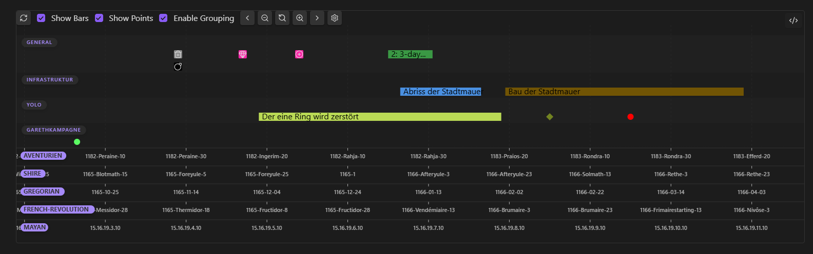

> [!NOTE]
> This is an automated translation of the German README (`LIESMICH.md`).

# Obsidian Gantt Timeline Plugin

Welcome to the documentation for the Gantt Timeline Plugin for Obsidian.
This plugin allows you to clearly display your notes and events in interactive timelines.



### Features & Structure

- **Events:** Each point or bar in the timeline corresponds to an event.
  - **Bars:** Represent time spans.
  - **Points / Symbols:** Represent specific points in time or milestones.
- **Decentralized in FrontMatter:** Events are defined directly within the YAML properties of your Markdown files.
- **Structuring:** Events can be organized, filtered, and sorted by groups and custom calendars.
- **Flexible Visibility:** Groups, calendars, time spans, and individual points can be shown or hidden independently.
- **Custom Styling:** Points in time can be customized with icons from [Lucide](https://lucide.dev) and custom colors.
- **Interactivity:**
  - Mouseover displays relevant metadata in a tooltip (Desktop).
  - Clicking an event directly opens the source note—optionally jumping to a specific heading.
  - Full navigation via drag & zoom (mouse wheel on Desktop, touch gestures on mobile devices).

> **Data Safety & Privacy:**
> The plugin reads your notes and can insert a code block into your current file upon request. It never deletes data
> from your vault and makes **no** network connections.

# Getting Started

## Gantt Chart / Timeline Creation

There are two simple ways to embed a timeline into a note:

### Option 1: Via Command / Ribbon Icon (Recommended)

1. Click the ribbon icon or open the command palette and select: `Gantt this: Open code block creator`.
2. The modal guides you step-by-step through the configuration:

- **Folder for Events:** Specify where the plugin should search for notes with event data (includes a toggle for
  recursive search in subfolders).
- **Folder for Calendars:** Specify where custom calendar definitions are stored.
- By default, the folder of the currently active file is suggested for both.

3. At the bottom of the modal, you can copy the generated code block or insert it directly at your current cursor
   position.

### Option 2: Manually in the Editor

Simply paste the following code block into any Markdown file:

````markdown
```gantt-this
```
````

## *Populating Your Gantt Chart / Timeline*

To display one or more notes as events in your timeline, add the corresponding properties to the YAML frontmatter of
your Markdown file:

```yaml
---
gantt-item: true           # Marks the note as an event
gantt-start: 2026-01-01    # Start date / point in time
gantt-end: 2026-01-05      # Optional: End date (Fallback is 'gantt-start')
gantt-name: "My Project"   # Optional: Name (Fallback is the file name)
gantt-group: "Development" # Optional: Group (Fallback is 'general')
---
```

## *Additional FrontMatter Options*

The following table lists all available properties you can use in your notes:

| Property                 | Type / Values                              | Optional? | Default / Fallback                                  | Description                                                               |
|:-------------------------|:-------------------------------------------|:----------|:----------------------------------------------------|:--------------------------------------------------------------------------|
| `gantt-item`             | Boolean                                    | No        | `true`                                              | Marks the note as an event target for the plugin.                         |
| `gantt-start`            | String                                     | No        | *None* (Note will be ignored without a start value) | Start date or start value of the event.                                   |
| `gantt-end`              | String                                     | Yes       | Value of `gantt-start`                              | End date of the event. If identical to start value, a point is displayed. |
| `gantt-name`             | String                                     | Yes       | File name without extension (`file.basename`)       | Name of the event in the timeline and tooltip.                            |
| `gantt-type`             | String                                     | Yes       | Plugin standard calendar                            | Determines the assigned calendar type.                                    |
| `gantt-group`            | String                                     | Yes       | `'general'`                                         | Group used for row layout and structuring.                                |
| `gantt-color`            | Color (e.g. `#ff0000`, `red`)              | Yes       | Group color → Calendar color → Default              | Overrides the background color of the event individually.                 |
| `gantt-displayIcon`      | String ([Lucide Icon](https://lucide.dev)) | Yes       | *None*                                              | Displays an icon on the event.                                            |
| `gantt-displayIconColor` | Color (e.g. `#ff0000`, `red`)              | Yes       | Default icon color                                  | Sets the color of the icon.                                               |
| `gantt-symbol`           | `bar`, `point`, `icon`, `diamond`          | Yes       | `bar` (time span) or `point` (point in time)        | Sets the visual representation format of the event.                       |
| `gantt-linkToHeader`     | String                                     | Yes       | *None* (Jumps to top of file)                       | Links directly to a specific heading when clicked.                        |

## *Custom Calendar Definitions*

If you use custom time systems or fictional calendars in your vault, you can define them using a separate note:

| Property                | Type / Values | Optional? | Default / Fallback | Description                                                         |
|:------------------------|:--------------|:----------|:-------------------|:--------------------------------------------------------------------|
| `gantt-type-definition` | String        | **No**    | *None*             | Unique identifier of the calendar for referencing via `gantt-type`. |
