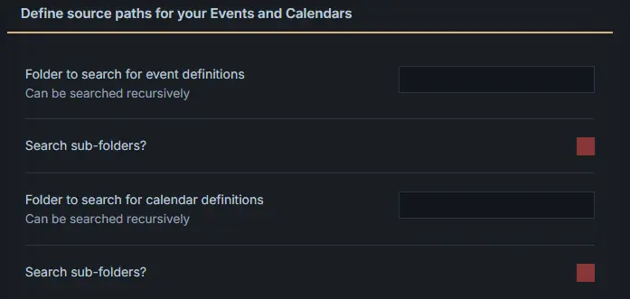
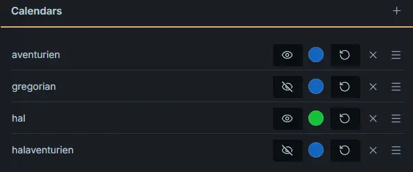

# Setup

## Fundamentals and first steps
To help you understand what you need to do to setup a gantt this chart in your obsidian note, here is an explanation of the fundamental workings of the gantt-this plugin.

The plugin renders a gantt chart from a codeblock as is usually done with other Obsidian plugins. To create that codeblock nothing more is needed than:

````markdown
```gantt-this
```
````

Of course without a calendar or events you will see exactly nothing.
So as a first step you will need a calendar. Each calendar definition is stored as a yaml definition in a yaml codeblock in a note. This calendar definition is stored in a separate note which you create in obsidian and put into a folder of your choice. For future reference we will store this in the folder "calendardefinitions".

This is an example for a TTRPG calendar of one of my favorite RPGs:
````markdown
```yaml
id: example # unique id for each calendar
name: Example Kalender # a calendar name as shown in the gantt chart
sharedOffset: 0
startDay: 1
type: rule-based
delimiter: "-"
ruleBasedDetails:
  daysInStandardYear: 365
  format: # input format of dates
    - "year"
    - "month"
    - "day"
  outputformat: # output format of dates (for display)
    - "day"
    - "month"
    - "year"
  months: 
    - name: Praios
      days: 30
    - name: Rondra
      days: 30
    - name: Efferd
      days: 30
    - name: Travia
      days: 30
    - name: Boron
      days: 30
    - name: Hesinde
      days: 30
    - name: Firun
      days: 30
    - name: Tsa
      days: 30
    - name: Phex
      days: 30
    - name: Peraine
      days: 30
    - name: Ingerim
      days: 30
    - name: Rahja
      days: 30
    - name: Namenloser
      days: 5
moons: # definition of moons and moon cycles
   - {offset: 10, cycle: 28, color: "#928440"}
```
````
There are more options to a calendar definition and many are optional but this should give you a quick calendar you can start from and adjust to your needs.

The next step is to define a front matter field for THIS note of the type:
gant-typed-definition: example   
or whatever else you name your calendar

Be aware that the frontmatter value (here: example) and the calendar id in the yaml code block must match exactly.

It will looke like this:
```markdownd
---
gantt-type-definition: example
---
```

The next step is to tell the plugin where it can find the calendar definitions and what calendars it is supposed to use. This is done in the plugin settings.


As you see no folder is selected. This means the plugin will revert to assuming that you want to search all folders from the root. Ideally you will input a specific folder like "Calendars" or similar. In our case it is "calendardefinitions"


For our case "Search sub-folders" would not be strictly necessary but I included it anyway. Also note that "Search sub-folders" for event definitions makes much sense because your events probably will be spread accross your vault.

The next step is to tell the plugin to use a specific calendar. This as also done in the settings.



As you see allready 4 calendars have been added. Each calendar can be set as visible or non visisble and each calendar can get a default color. The hal calendar has a default of green.

You add the calendar by choosing the "+" sign beside the Calendars heading and inputing the id of the calendar you want to add (this would be "example" in our case).

Now after we have set up the calendar the next step is to create an event definition. This is done by creating a markdown file and adding frontmatter properties. 

The plugin will look for files with the following frontmatter properties: gantt-start and gantt-type

For our example we need this:
```markdown
---
gantt-type: example
gantt-start: 1000-01-20
---
```

This will create an event for the example calendar in the year 1000 in the first year of the month on day 20.

Finally we need to add a gantt chart to one of our notes. As mentioned above create a new note and add a code block of the gantt-this type like this:

### Option 1: Via Command / Ribbon Icon (Recommended)

1. Click the ribbon icon or open the command palette and select: `Gantt this: Open code block creator`.
2. The modal guides you step-by-step through the configuration:

- **Folder for Events:** Specify where the plugin should search for notes with event data (includes a toggle for
  recursive search in subfolders).
- **Folder for Calendars:** Specify where custom calendar definitions are stored.
- By default, the folder of the currently active file is suggested for both.

3. At the bottom of the modal, you can copy the generated code block or insert it directly at your current cursor
   position.

### Option 2: Manually in the Editor

Simply paste the following code block into any Markdown file:

````markdown
```gantt-this
```
````

After it renders you should see this when you hover your mouse over the blue point which represents the event:


Gratulation! You got your first calendar and event running and displayed!

You might like to take a look at:
[Calendar properties](02-Calendar_properties.md)
[Frontmatter properties](03-Event_frontmatter_properties.md)
[More fundamentals](04-More_fundamentals.md)
[Advanced topics](05-Advanced_topics.md)
